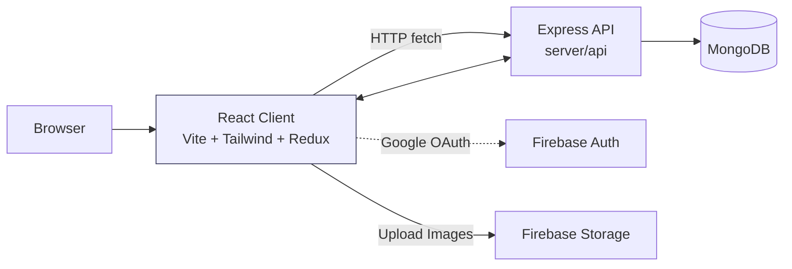
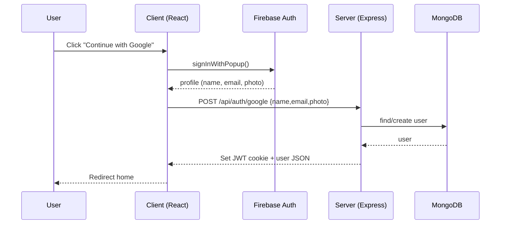
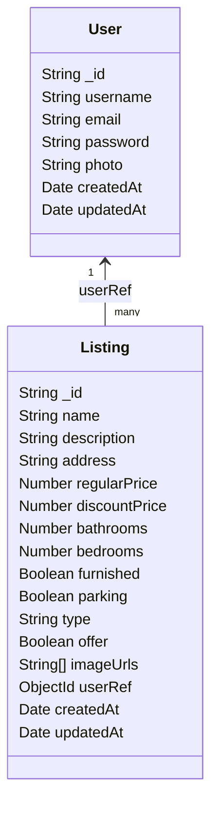

# Bilal Estate — MERN Real Estate Marketplace

## Overview

- Full‑stack MERN application to list, search, and manage real‑estate properties.
- Secure authentication (JWT in HTTP‑only cookie) and Google OAuth.
- Listings CRUD with image uploads to Firebase Storage and advanced search (filters, sorting, pagination).
- Responsive UI built with React + Vite and Tailwind CSS. Vercel‑ready routing included.

## Tech Stack

- Frontend: React 18, Vite, React Router v6, Redux Toolkit + Redux Persist, Tailwind CSS, Swiper, Firebase (Auth/Storage)
- Backend: Node.js, Express, MongoDB, Mongoose, JWT, bcryptjs, cookie‑parser, CORS, dotenv
- Deployment: Vercel (Serverless API + Static client)

## Monorepo Structure

- /client — React app (Vite)
- /server — Express API (Node.js)
- /vercel.json — Vercel config for client + server routes

## Key Features

- Email/password auth and Google OAuth
- Protected routes and ownership checks using JWT
- Create, update, delete property listings
- Firebase Storage for image hosting
- Search with filters (type, offer, parking, furnished), sorting and pagination
- Mobile‑first UI with Swiper‑based hero/slider

## Usage & Access

- Ye repository private/proprietary hai. Public cloning, redistribution ya self‑hosting allowed nahi hai.
- Access sirf owner ki ijazat se milega. Zarurat parhne par contact karein.

## Architecture Diagrams (Mermaid)

## API Overview (Private)

- Modules: Auth, Users, Listings
- Endpoints and implementation details intentionally omitted in this public README.

## Screens & Flows

- Home with hero and recent listings
- Auth (Sign In, Sign Up, Google OAuth)
- Profile (update details, manage your listings)
- Create/Update Listing with image upload
- Search results with filters and “Show more” pagination

## Security & Best Practices

- JWT stored in HTTP‑only cookie
- Ownership checks on update/delete listing
- No secrets committed to the repo—use environment variables

## License

- Proprietary — All rights reserved. Unauthorized copying or redistribution is prohibited.

## Author

- Developed by Bilal
